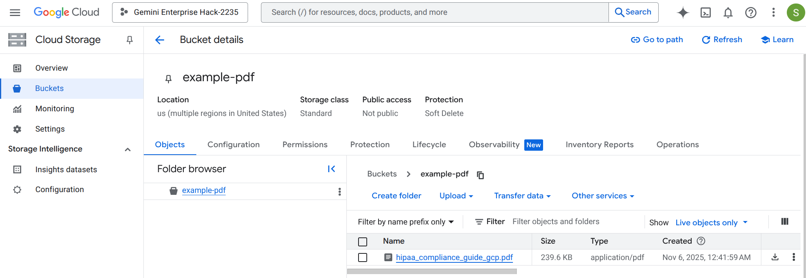
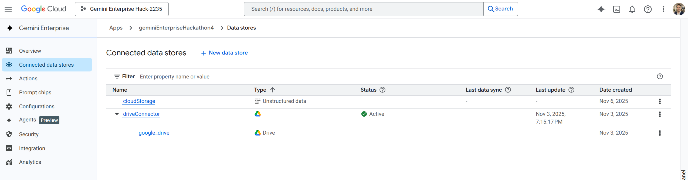
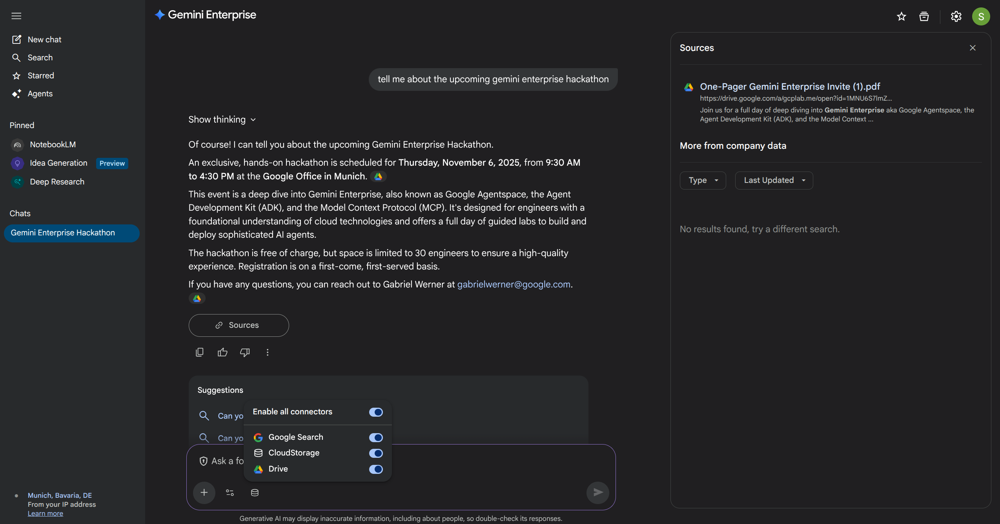
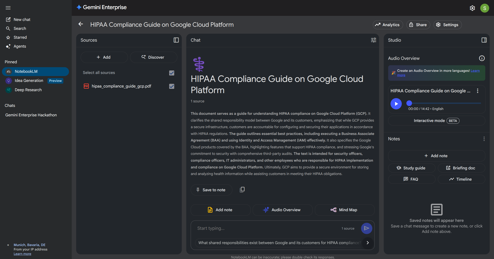

# 🛠️ Lab 1: Environment Setup & No-Code Agent

Welcome to Lab 1! In this session, you'll set up your development environment and create your first AI agent without writing a single line of code.

> [!IMPORTANT]
> This Google Cloud environment is **temporary** and will be purged after the event. Please save any important files you wish to keep.

---

## 🚀 Step-by-Step Instructions

### 1. 🔑 Log In
Use the provided username and password to log in to the [Google Cloud Console](https://console.cloud.google.com/).

### 2. ✨ Activate Gemini
Use the search bar to navigate to **"Gemini Enterprise"** and activate the trial license.

### 3. 📁 Prepare Your Data
1.  **Create a Bucket:** Create a Google Cloud Storage Bucket [(via Console or CLI)](https://docs.cloud.google.com/storage/docs/creating-buckets#console).
2.  **Upload:** Upload a PDF of your choice to the bucket.

### 4. 🔗 Connect to Gemini Enterprise
1.  **Create App:** Create a new Gemini Enterprise app.
2.  **Connect GCS:** [Connect your bucket](https://docs.cloud.google.com/gemini/enterprise/docs/connect-cloud-storage) to the app.

> [!TIP]
> **Optional:** You can also upload a PDF to your **Google Drive** and [connect it](https://docs.cloud.google.com/gemini/enterprise/docs/connect-google-drive) as well!

### 5. 💬 Start Chatting!
Indexing can take up to **10 minutes**. Once finished, you can ask Gemini Enterprise questions about your PDFs.

---

## 🌟 Bonus Activities

If you have extra time, try these out:

*   🎨 **Image Generation:** Ask Gemini to create a suiting image for your topic.
*   🎧 **NotebookLM Audio:** Upload a document to [NotebookLM](https://notebooklm.google.com/) and [generate an audio overview](https://support.google.com/notebooklm/answer/16212820?hl=en).
    
*   🤖 **Agent Designer:** Create a no-code agent using the [Agent Designer](https://docs.cloud.google.com/gemini/enterprise/docs/agent-designer) (Preview Feature).

---

Happy Building! 🚀
