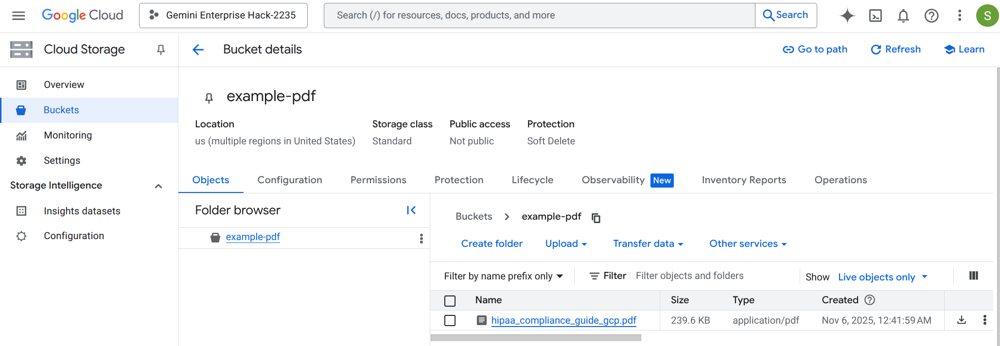
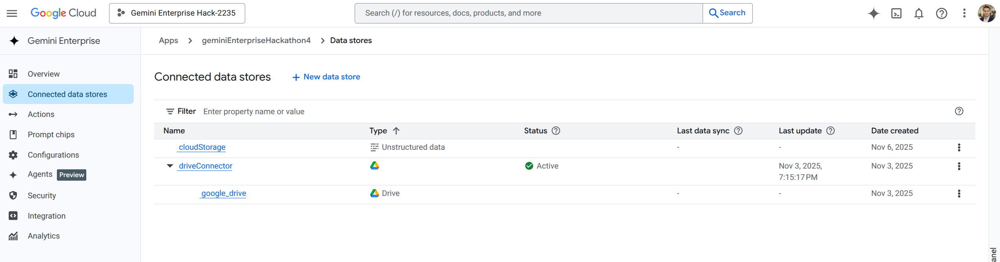

# 🛠️ Lab 1: Environment Setup & No-Code-Agent

- We will provide you with a username and password for your temporary Devstar Environment. 
- Please note that this Google Cloud environment is temporary and will be purged after the event. 
- Make sure to save any important files that you would like to keep.  
- Use these credentials to log in to https://console.cloud.google.com/.
- Then use the search bar to to navigate to "Gemini Enterprise" and activate the trial license. 
- Create a Google Cloud Storage Bucket [(either by using the console or the Google Cloud command line)](https://docs.cloud.google.com/storage/docs/creating-buckets#console) and upload a PDF of your choice. This is how it should look like: 

- Create a new Gemini Enterprise app. 
- [Connect your bucket containing your PDF to Gemini Enterprise](https://docs.cloud.google.com/gemini/enterprise/docs/connect-cloud-storage)
- Optional: Navigate to your Google Drive and upload another PDF of your choice. 
- Optional: Then connect Gemini Enterprise to your Google Drive following this tutorial: https://docs.cloud.google.com/gemini/enterprise/docs/connect-google-drive
- This is how the connected data stores should look like:

- Indexing can take up to 10 minutes. Afterwards, you should be able to ask Gemini Enterprise questions about your PDFs in the Storage Bucket (and, optionally, Google Drive).

 

 - If you like, ask Gemini to create a suiting image. 

- If you have time left: Navigate to NotebookLM, upload a Document with an interesting topic of your choice, and [generate the audio output. ](https://support.google.com/notebooklm/answer/16212820?hl=en)

- If you have even more time left, create a no-code agent using the [Agent Designer](https://docs.cloud.google.com/gemini/enterprise/docs/agent-designer). This is a preview feature. 

