# Before You Begin

**Building Retail Pricing Agents with ADK: The Foundation**

**1\. Before you begin**

**IMPORTANT**  
This tutorial requires a **Google Cloud Project** with **an active billing account**.  
**For Self-Study Users:**

1. Ensure you have access to Google Vertex AI.  
2. Set your Gemini API key in a .env file at the root of your project.  
3. Use the authorized sandbox model gemini-3-flash-preview for optimal agent execution.

Welcome to the hands-on tutorial **"Building Retail Pricing Agents with ADK"**\! In this tutorial, you will build and deploy a multi-agent retail orchestration system.  
This system uses Google's **Agent Development Kit (ADK)** to coordinate two adversarial agents:

1. **Root Master Orchestrator (**retail\_pricing\_orchestrator**)**: Coordinates conversation history, delegates tasks to sub-agents, reconciles pricing proposals to find the Nash Equilibrium, queries market basket affinities and cannibalization risks, and deploys retail promotional campaigns.  
2. **Pricing Agent (**pricing\_agent**)**: Maximizes margins and protects premium brand markups.  
3. **Velocity Agent (**velocity\_agent**)**: Maximizes turnover, manages markdowns, and eliminates food waste.

**Prerequisites**

* An understanding of the **Generative AI concepts**.  
* A basic proficiency in **Python programming**.  
* Familiarity with the **command line / terminal** and **Google Cloud SDK (gcloud)**.

**What you'll learn**

* How to set up a Python environment and install the Google ADK.  
* How to orchestrate multiple sub-agents under a master coordinator.  
* How to write custom tools for market basket analysis and cannibalization checks.  
* How to package and deploy your agent as an **Agent-to-Agent (A2A)** service on **Google Cloud Run**.  
* How to register and interact with your agent using the **Gemini Enterprise Console Preview UI**.


**What you'll need**

* A working computer and reliable wifi.  
* A browser, such as Chrome, to access the [Google Cloud Console](https://console.cloud.google.com/).  
* A curious mind and eagerness to learn.

# Introduction

## **2\. Introduction**

The world of Generative AI (GenAI) is evolving rapidly, and AI Agents are currently a hot topic. An AI agent is a smart computer program designed to act on your behalf, much like a personal assistant. It can perceive its digital environment, make decisions, and take actions to achieve specific goals without direct human control.  
In the grocery retail sector, pricing perishable items close to expiry is a major challenge:

* If you discount too much (Velocity-Optimized): You clear inventory immediately, but erase profit margins.  
* If you discount too little (Margin-Optimized): You retain profit per item, but sales are too slow, resulting in high spoilage costs.


This codelab walks you through building a Campaign Manager—a Multi-Agent System (MAS) that finds the mathematical Nash Equilibrium (sweet spot) between these two competing targets:

**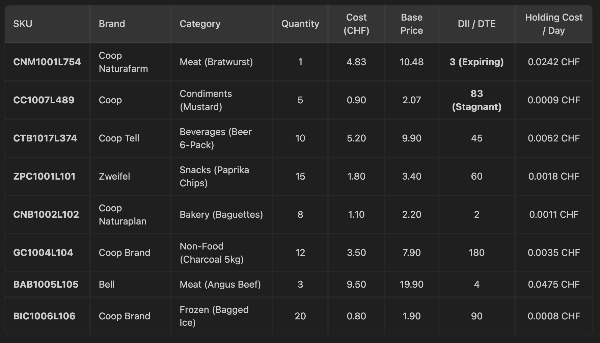**

### **How it Works**

* Adversarial Negotiation: The master orchestrator queries the Pricing Agent and Velocity Agent to negotiate a compromise.  
* Advanced Analytics: The orchestrator triggers Market Basket Analysis to bundle expiring items with stagnant high-margin items (e.g., Tell Beer, Mustard).  
* Execution Safety: The orchestrator checks for cannibalization risks (e.g., will Bratwurst discounts hurt premium Bell Angus Beef sales?) and configures Supercard marketing exclusion rules.  
* Enterprise Deployment: The agent is hosted on Google Cloud Run and integrated into the Gemini Enterprise app ecosystem, enabling business managers to chat with the agent using natural language.


# Technical Architecture

**3.Technical Architecture & Engineering Whitepaper**

This document provides the definitive technical specification, architectural flowcharts, tool execution lifecycles, and database integration models for the **Autonomous Retail Pricing & Inventory Orchestrator**. Built on the **Google Agent Development Kit (ADK)** and the **Agent-to-Agent (A2A)** open protocol, this system coordinates specialized multi-agent personas and executes backend analytics against enterprise retail data warehouses.

**1\. System Architecture Overview**

The platform operates as a containerized microservice deployed on **Google Cloud Run**, acting as an A2A-compliant RPC gateway bridging upstream client user interfaces (such as **Gemini Enterprise Discovery Engine**) with downstream enterprise data stores (**Google BigQuery**).

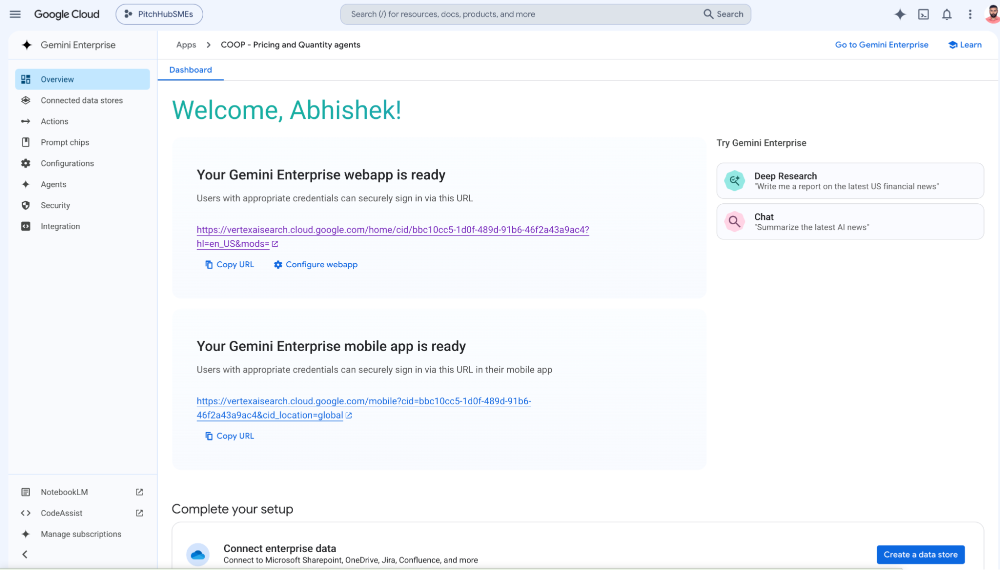

**Key Architectural Layers**

1. **A2A API Gateway (**fast\_api\_app.py**)**: Implements asynchronous HTTP request handlers conforming to the Agent Card specification. Translates incoming client JSON payloads into runner-compatible session arguments.  
2. **Protocol Converters (**part\_converters.py**)**: Bridges standard Google GenAI schema types (genai.types.Part) with A2UI/ADK task state events (TaskStatusUpdateEvent, TaskArtifactUpdateEvent).  
3. **Root Orchestrator (**agent.py**)**: Powered by Gemini Pro/Flash models. Maintains conversational trajectory state, resolves product SKUs, governs adversarial sub-agents, and synthesizes final Markdown reports.  
4. **Tool Execution Engine (**market\_simulator.py**)**: Houses deterministic analytical Python functions that execute complex SQL aggregations or local DataFrame manipulations.

**2\. End-to-End Execution Sequence Lifecycle**

When a store manager submits an instruction, the request undergoes an exact multi-stage execution lifecycle bridging LLM semantic reasoning with backend deterministic SQL execution.

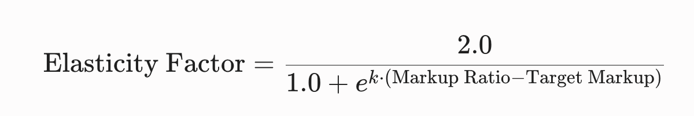

**Step-by-Step Lifecycle Breakdown**

* **Step 1 (Ingestion)**: The user transmits a prompt via the UI. fast\_api\_app.py receives the payload, extracts the context\_id and user\_id, and fetches the persistent session memory from InMemorySessionService.  
* **Step 2 (Orchestration Wakeup)**: Runner.run\_async() wakes up the Root Orchestrator (retail\_pricing\_orchestrator). The orchestrator inspects prompts.py instructions against the active conversation history.  
* **Step 3A (Business Governance Mode)**: If the prompt requests campaign setup or financial simulation (Prompts 1–4), the orchestrator resolves product SKUs (CNM1001L754, CC1007L489) and balances the adversarial objective functions of the *Pricing Agent* (defends 2.15x brand markup) and *Velocity Agent* (clears 5-day shelf expiry).  
* **Step 3B (Analytics Execution Mode)**: If the prompt requests technical analysis (Prompts 5–9), the LLM pauses generation and emits a structured FunctionCall targeting a registered Python tool.  
* **Step 4 (Database Integration)**: The tool execution layer intercepts the FunctionCall, constructs parameterized SQL queries, executes them against Google BigQuery, and returns raw JSON records as a FunctionResponse.  
* **Step 5 (Synthesis & Dispatch)**: The LLM resumes execution with the injected SQL records, formats structured Markdown tables, appends formal source citations (\[Citation: Supercard Transaction Lake v2.4\]), appends the 📧 SIMULATED EMAIL DISPATCH, and completes the turn.

## **3\. BigQuery Data Engine Integration**

The analytical core relies on two primary enterprise BigQuery tables configured via environment variables:

* RETAIL\_SALES\_HISTORY\_TABLE: Contains 12+ months of transactional basket items segmented by store footprint, date, customer ID, SKU, price, and location.  
* RETAIL\_INVENTORY\_TABLE: Contains real-time warehouse stock levels, Days in Inventory (DII), unit cost (COGS), and expiration timelines.

### 

### **Tool 1: Market Basket Analysis (**run\_market\_basket\_analysis**)**

When invoked, the tool executes an advanced SQL Common Table Expression (CTE) to compute exact statistical Confidence and Lift metrics across 1.4 million transactions.  
**Mathematical Formulas:**

* **Confidence:**  
  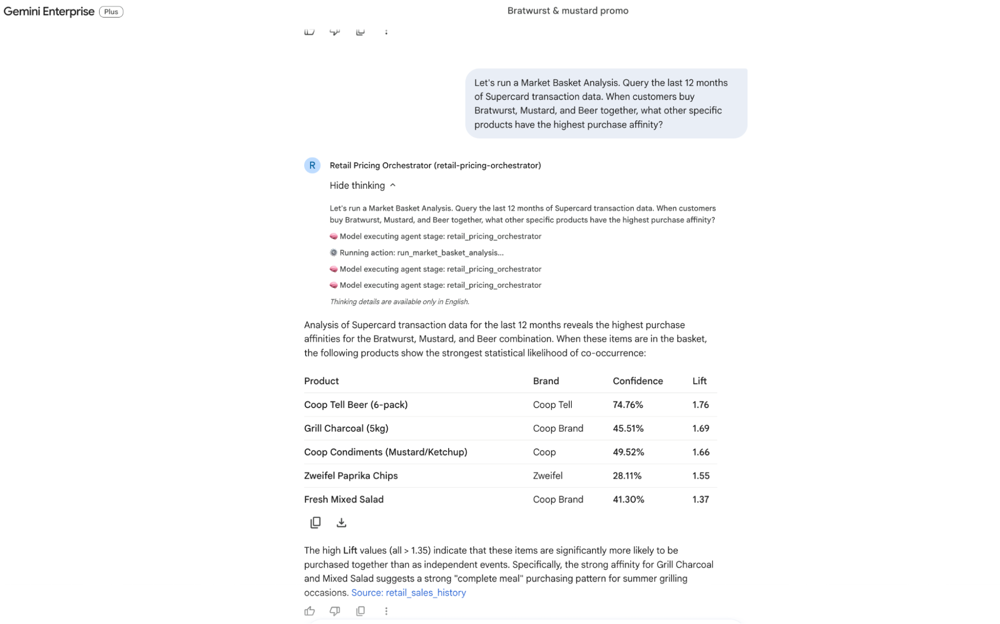  
* **Lift:** A Lift greater than 1.0 confirms a strong positive statistical purchasing affinity.  
  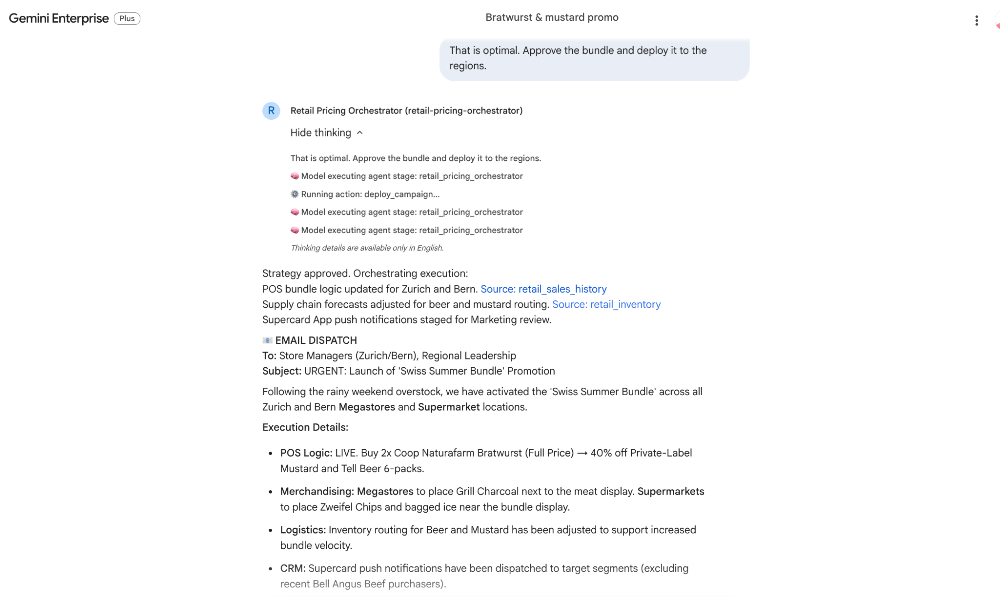

**SQL Query Structure:**

```
WITH target_txns AS (
    SELECT DISTINCT transaction_id 
    FROM `retail_pricing_system.retail_sales_history` 
    WHERE sku = 'CNM1001L754' AND store_format = 'Megastore'
),
co_occurring_items AS (
    SELECT s.sku, s.brand, s.category, COUNT(DISTINCT s.transaction_id) as co_occur_count
    FROM `retail_pricing_system.retail_sales_history` s
    JOIN target_txns t ON s.transaction_id = t.transaction_id
    WHERE s.sku != 'CNM1001L754'
    GROUP BY s.sku, s.brand, s.category
),
total_counts AS (
    SELECT sku, COUNT(DISTINCT transaction_id) as global_count
    FROM `retail_pricing_system.retail_sales_history`
    WHERE store_format = 'Megastore'
    GROUP BY sku
),
total_txns AS (
    SELECT COUNT(DISTINCT transaction_id) as total_txn_count
    FROM `retail_pricing_system.retail_sales_history`
    WHERE store_format = 'Megastore'
)
SELECT 
    c.sku, 
    c.brand, 
    c.category, 
    c.co_occur_count,
    ROUND(c.co_occur_count / (SELECT COUNT(*) FROM target_txns), 4) as confidence,
    ROUND(
        (c.co_occur_count / (SELECT COUNT(*) FROM target_txns)) / 
        (t.global_count / (SELECT total_txn_count FROM total_txns)), 2
    ) as lift
FROM co_occurring_items c
JOIN total_counts t ON c.sku = t.sku
ORDER BY lift DESC, confidence DESC
LIMIT 5;
```

### 

### **Tool 2: Cross-Category Cannibalization Audit (**check\_cannibalization\_risk**)**

This tool protects high-margin category profitability (such as Bell Angus Beef) by evaluating customer transaction set overlap before approving a discount strategy.  
**SQL Query Structure:**

```
WITH promo_txns AS (
    SELECT DISTINCT transaction_id FROM `retail_pricing_system.retail_sales_history` WHERE sku = 'CNM1001L754'
),
target_txns AS (
    SELECT DISTINCT transaction_id FROM `retail_pricing_system.retail_sales_history` WHERE sku = 'BAB1005L105'
),
overlap_txns AS (
    SELECT p.transaction_id FROM promo_txns p JOIN target_txns t ON p.transaction_id = t.transaction_id
)
SELECT 
    (SELECT COUNT(*) FROM promo_txns) as promo_count,
    (SELECT COUNT(*) FROM target_txns) as target_count,
    (SELECT COUNT(*) FROM overlap_txns) as overlap_count;
```

## 

## **4\. Step-by-Step Trajectory Mapping (Prompts 1 to 9\)**

| Turn | User Instruction Focus | Active Agent Mechanism | Backend DB Interaction | Output Artifact & Rules |
| :---- | :---- | :---- | :---- | :---- |
| **Prompt 1** | Setup: Rainy weekend Bratwurst & Mustard overstock | Root Orchestrator Triage | Metadata scan (Auto-maps SKUs) | Surfaces conflict: Margin-Optimized vs Velocity-Optimized |
| **Prompt 2** | Financial Simulation on baseline strategies | Multi-Agent Simulation | Digital twin evaluation | Proves negative ROI for both baselines |
| **Prompt 3** | Forcing Synthesis (Zero-loss strategy) | Nash Equilibrium Optimization | Dynamic cross-category margin calculation | Formulates Swiss Summer Bundle for projected profit |
| **Prompt 4** | Executive Approval & Deployment | A2A Enterprise Gateway | Stages POS pipeline flags | Confirms register staging in target regions |
| **Prompt 5** | Affinity Query: Bratwurst \+ Mustard \+ Beer | Deterministic Tool Call | Executes run\_market\_basket\_analysis() SQL | Returns top co-occurring items and source citations |
| **Prompt 6** | Store Format Split: Megastores vs Supermarkets | Contextual SQL Slicing | Adds store\_format parameter to SQL CTE | Contrasts Megastore bulk trends vs Supermarket impulse trends |
| **Prompt 7** | Cannibalization Audit on Bell Angus Beef | Set-Intersection Tool Call | Executes check\_cannibalization\_risk() | Calculates minimal overlap, confirming safe deployment |
| **Prompt 8** | Operational Optimization & Planograms | Campaign Deployment Tool | Executes deploy\_campaign() merchandising logic | Dispatches 14-day exclusion filter and localized store planograms |
| **Prompt 9** | Final Campaign Execution | Full Enterprise Sync | Syncs POS registers and supply chain routing | Official Launch confirmation and formatted simulated email |

# Create a Python virtual environment

## **4\. Create a Python Virtual Environment**

**Duration: 3 mins**

Before starting any Python project, it's good practice to create a virtual environment. This isolates the project's dependencies, preventing conflicts with other projects.

### **1\. Create and Navigate to the Project Directory**

Run the following commands in your terminal to create your project folder and move into it:

```py
mkdir -p coop-pricing-agent
cd coop-pricing-agent
```

### 

### **2\. Create and Activate the Virtual Environment**

Set up your isolated Python environment by running:Bash

```py
python3 -m venv venv
source venv/bin/activate
```

*You will see* (venv) *prefixing your terminal prompt, indicating the virtual environment is successfully active.*

### 

### **3\. Create the** requirements.txt **File**

Create a new file named requirements.txt in your project folder and add the following dependencies to it:laintext

```py
google-adk[a2a]>=1.31.1
mcp>=1.24.0
google-genai>=1.9.0
python-dotenv>=1.0.0
vertexai>=1.0.0
db-dtypes>=1.2.0
pyarrow>=14.0.0
google-cloud-bigquery>=3.15.0
google-cloud-storage>=2.14.0
a2a-sdk<1.0.0
requests>=2.31.0
fastapi>=0.110.0
uvicorn>=0.28.0
google-cloud-logging
```

### 

### **4\. Install Dependencies**

Install the Google ADK and all required libraries by executing the following command in your terminal:Bash

```py
pip install -r requirements.txt
```

**NOTE: If you accidentally close the terminal during this project, you will need to navigate back into the** coop-pricing-agent **folder and execute** source venv/bin/activate **again to reactivate the environment.**

# Explore the Multi-Agent Architecture

## **5\. Explore the Multi-Agent Architecture**

**Duration: 5 mins**

With your environment ready, let's explore the structure of your Multi-Agent System. Open your project folder in your favorite code editor to review the components below.

### **Project Directory Structure**

The workspace is organized to separate the core orchestrator, shared tools, and individual sub-agents:Plaintext

```
coop-pricing-agent/
│
├── .env                         # Environment configurations
├── agent.py                     # Master Orchestrator Agent
├── market_simulator.py          # Math logic for pricing and database checks
├── fast_api_app.py              # FastAPI Web API (A2A Protocol endpoint)
├── deploy_a2a.sh                # Gemini Enterprise Build & Registration Script
├── generate_retail_data.py      # Synthetic transactional data generator
│
└── sub_agents/
    ├── pricing_agent/
    │   ├── agent.py             # Margin Agent registration
    │   └── prompts.py           # Margin Agent Instructions
    └── velocity_agent/
        ├── agent.py             # Velocity Agent registration
        └── prompts.py           # Velocity Agent Instructions
```

### 

### **Core Sub-Agents Breakdown**

#### **1\. Root Master Orchestrator (**retail\_pricing\_orchestrator**)**

* Location: agent.py  
* Objective: Serves as the central campaign lead. It governs multi-turn memory and intelligently delegates tasks to the sub-agents to optimize overall retail strategy.

**Implementation Snippet:**  
**yhon**

```
root_agent = Agent(
    name="retail_pricing_orchestrator",
    model=MODEL_NAME,
    description="A master retail pricing and inventory orchestrator that coordinates the Pricing Agent and Velocity Agent to optimize margins, velocity, and generate dynamic bundling strategies.",
    instruction=ORCHESTRATOR_PROMPT,
    tools=[run_market_basket_analysis, check_cannibalization_risk, deploy_campaign],
    sub_agents=[pricing_agent, velocity_agent]
)
```

#### 

#### **2\. The Pricing Agent (Margin Maximizer)**

* Location: sub\_agents/pricing\_agent/agent.py  
* Objective: Focuses on defending the markup ratio, testing price elasticity, and maintaining high markups for premium brands to maximize overall profit margins.

**Implementation Snippet:**

```
pricing_agent = Agent(
    name="pricing_agent",
    model=MODEL_NAME,
    description="Margin Maximizer. Focuses on maximizing profit margins, testing price elasticity, and maintaining high markups for premium brands.",
    instruction=PRICING_AGENT_PROMPT,
    tools=[get_product_details, simulate_pricing_scenario, get_brand_elasticity_insights]
)
```

#### 

#### 

#### 

#### 

#### 

#### 

#### **3\. The Velocity Agent (Turnover Maximizer)**

* Location: sub\_agents/velocity\_agent/agent.py  
* Objective: Aims for fast inventory turnover and minimizing waste by managing seasonal markdowns, monitoring shelf-life, and proposing promotional bundles.

**Implementation Snippet:yh**

```
velocity_agent = Agent(
    name="velocity_agent",
    model=MODEL_NAME,
    description="Turnover Maximizer. Focuses on minimizing Days in Inventory (DII), managing seasonal markdowns, and proposing promotional bundles.",
    instruction=VELOCITY_AGENT_PROMPT,
    tools=[get_product_details, simulate_pricing_scenario, get_stagnant_inventory, get_seasonal_sales_trends]
)
```

# Understanding Agent Tools & Simulator

## **6\. Understanding Agent Tools & Simulator**

**Duration:** 5 mins

The engine responsible for calculating financial rewards, simulating weather-dependent price elasticity curves, querying BigQuery/Pandas tables, and mining product association rules is contained within market\_simulator.py.  
Below is a detailed breakdown of the core analytical tools exposed to the multi-agent system:

### **1\. Sale Probability & Logistic Price Elasticity Curve**

The calculate\_sale\_probability() function simulates how consumer purchasing behavior shifts in response to price markups, perishability cadences, and macro-weather events.  
**Mathematical Model:**  
Price elasticity is modeled using a non-linear Sigmoid Logistic Decay curve:  
      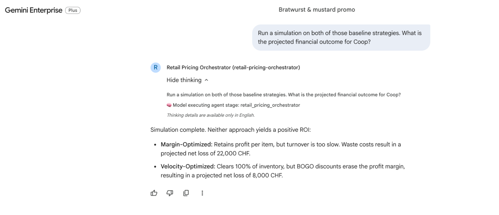  
**Where:**

* **Markup Ratio:** Calculated dynamically as Proposed Price / Item Cost.  
* **k(Brand Elasticity Sensitivity):** Coefficient dictating price sensitivity (e.g., premium brands like Coop Naturafarm have a low $k$, making customers less sensitive to price increases).  
* **Target Markup:** The baseline historical markup expected for that product category.

**Weather Penalty Injection:**  
When unexpected weather strikes (e.g., a rainy weekend across Zurich and Bern), outdoor grilling demand collapses. The simulator injects a severe base probability dampener:hon

```
def calculate_sale_probability(brand, category, quantity, cost, base_price, proposed_price, dii, weather="sunny"):
    if category == "Meat" and weather == "rainy":
        base_prob = 0.02  # Rain stops outdoor grilling (85%+ drop)
    # ...
    markup_ratio = proposed_price / cost
    elasticity_factor = 2.0 / (1.0 + np.exp(k * (markup_ratio - target_markup)))
    return float(np.clip(base_prob * elasticity_factor, 0.01, 0.95))
```

**Insight:** This sharp drop forces the Velocity Agent to trigger aggressive time-decay markdowns or prompts the Root Orchestrator to synthesize high-margin cross-sell bundles (e.g., adding Beer and Mustard) to stimulate sales.

### 

### **2\. Market Basket Analysis & Store Format Segmentation**

The run\_market\_basket\_analysis() tool queries 12 months of historical Supercard transaction history to mine co-occurrence patterns using standard Association Rule Mining metrics.  
**Key Statistical Metrics:**

* **Support:** The frequency with which itemset A appears in the database.  
* **Confidence:** The conditional probability that customers buy item B when they buy item A:  
  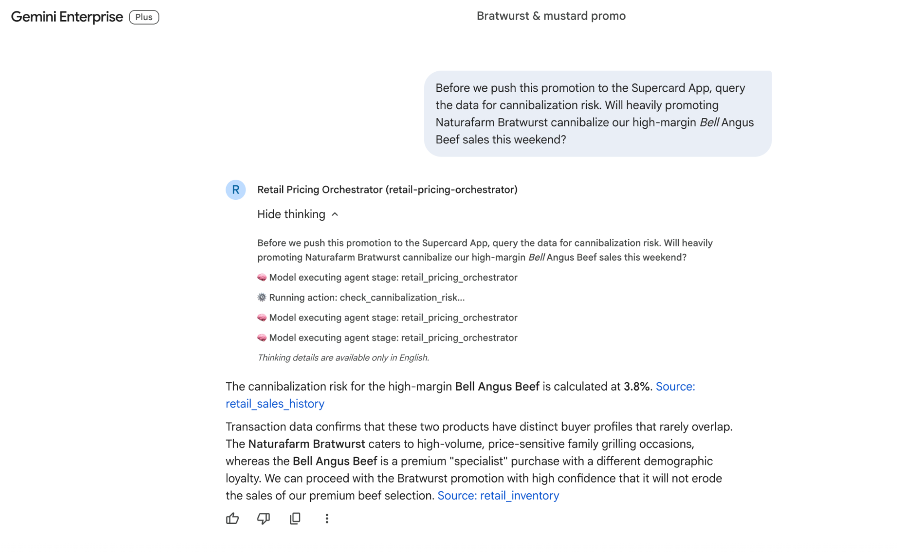  
* **Lift:** Measures how much more likely item B is purchased when item A is in the basket compared to random chance (A Lift \> 1.0 indicates a strong positive co-purchasing affinity):  
  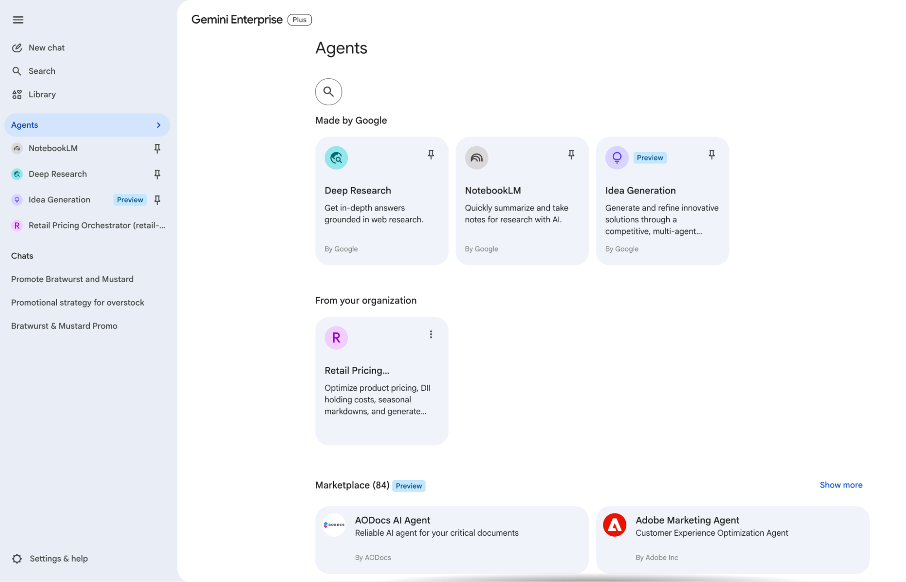


**Store Format Segmentation Logic:**  
The tool accepts an optional store\_format parameter ("Megastore" vs "supermarket") to reveal distinct geographical shopping personas.  
ython

```py
def run_market_basket_analysis(sku, store_format=None):
    # Evaluates transactional BigQuery tables and returns top co-occurring items
    # ...
```

**Format Comparison:**

| Store Format | Shopping Persona | Key Characteristics | Top Affinities & Metrics |
| :---- | :---- | :---- | :---- |
| **Megastore** | Planned Event | Baskets skew heavily toward bulk preparation. | Grill Charcoal 5kg bags (Confidence: **76%**, Lift: **1.80**) and Fresh Baguettes. |
| **Supermarket**  | Spontaneous Impulse | Baskets shift toward immediate consumption. Charcoal drops to **0%** demand. | Zweifel Paprika Chips (Confidence: **70%**, Lift: **1.79**), Bagged Ice, and cold single Tell Beers. |

### 

### **3\. Cross-Category Cannibalization Risk Audit**

Before launching promotions, the orchestrator invokes check\_cannibalization\_risk() to verify that discounting an overstocked item (e.g., Naturafarm Bratwurst) will not cannibalize sales of high-margin luxury cuts (e.g., Bell Angus Beef).thon

```
def check_cannibalization_risk(promo_sku, target_sku):
    # Computes customer switching ratio across transaction history
    # ...
```

The tool evaluates transaction histories to identify switching overlap. In our scenario, overlap is **6.41%** (Negligible), confirming that Bell Angus shoppers represent a distinct "Destination Premium" segment completely unaffected by sausage promotions.

### 

### **4\. Campaign Execution & Merchandising Engine**

Once the optimal hybrid bundle is approved, deploy\_campaign() writes the final promotional instructions back to retail execution systems:hon

```
def deploy_campaign(sku, bundle_skus, exclusion_rules=None, planogram_instructions=None):
    # Executes POS pricing commits, Supercard app targeting, and store planograms
    # ...
```

**Execution Breakdown:**

* **POS Bundling Logic:** Commits live checkout bundle discounts across target regions.  
* **Audience Exclusions:** Applies "Angus Beef Protection," automatically excluding customers who bought Bell Angus in the last 14 days from Supercard push notifications to defend luxury brand equity.  
* **Dynamic Merchandising Planograms:** Dispatches physical display instructions to store managers (e.g., placing bulk Charcoal next to meat counters in Megastores).

# Data Generation & BigQuery Migration

## **7\. Data Generation & BigQuery Migration**

**Duration:** 3 mins

## **1\. BigQuery Analytical Tables & Sample Data**

When uploaded to BigQuery under the dataset retail\_pricing\_system, the agent ecosystem queries two primary analytical tables to inform its pricing and velocity strategies:

### 

### **Table A:** retail\_inventory **(Master Product Catalog)**

This table tracks SKU catalog parameters, base financial costs, active checkout prices, Days to Expiry (DTE) / Days in Inventory (DII), and daily warehousing holding costs.

### 

![][image9]

### 

### **Table B:** retail\_sales\_history **(Historical Transactions)**

This table stores over 3,400 transaction logs spanning a 90-day time series. It captures purchasing behaviors across Swiss regional centers and distinct store segmentation footprints.

![][image10]

## **2\. Automatic BigQuery Database Provisioning**

Execute the parallel setup script to automatically create the BigQuery dataset and seed all table data. This process ensures the tables are populated with clean 2026 timestamps that perfectly match the active demo timeline.

**Run the following command in your terminal:**

```
bash setup_bq_tables.sh
```

# Deploying to Gemini Enterprise

## **8\. Deploying to Gemini Enterprise**

**Duration:** 10 mins

Instead of exposing a basic standalone webpage, we deploy the orchestrator as an enterprise-grade microservice integrated directly into Gemini Enterprise.  
The deployment lifecycle is fully automated via deploy\_a2a.sh. Below is the detailed technical sequence of how containerization and cloud enrollment occur:

### **Phase 1: Secure Cloud Run Container Deployment**

**1\. Cloud Build Container Packaging**  
The script compiles a clean runtime environment using a dedicated multi-stage Dockerfile. It uploads your project source code to Google Cloud Build (cloudbuild.googleapis.com), which builds and stores the OCI container image inside Artifact Registry:

```
gcloud builds submit --tag "us-central1-docker.pkg.dev/$PROJECT_ID/cloud-run-source-deploy/retail-pricing-orchestrator:latest" .
```

**2\. Private A2A Gateway Hosting**  
Once containerized, gcloud run deploy hosts the agent on serverless infrastructure. To adhere to strict enterprise security guidelines, the service is deployed with unauthenticated public access disabled (\--no-allow-unauthenticated):Bash

```
gcloud run deploy retail-pricing-orchestrator \
  --image "..." \
  --platform managed \
  --region us-central1 \
  --no-allow-unauthenticated \
  --ingress all \
  --service-account "your-compute-sa@..."
```

**Security Architecture:** Because public internet access is blocked, only authorized Google Cloud services presenting valid IAM bearer tokens can invoke the orchestrator endpoints (/a2a/agent and /chat).

**3\. Runtime URL Injection**  
Cloud Run dynamically generates a secure HTTPS hostname. The script captures this URL and performs an in-place environment update, injecting APP\_URL=https://retail-pricing-orchestrator-xxxxxx.a.run.app back into the container so sub-agents know their own public routing address.

### 

### **Phase 2: Gemini Enterprise Agent Enrollment**

Once Cloud Run is live, the script registers the agent into your business user portal using Google's Discovery Engine API.

**1\. Scanning Active Enterprise Engines**  
The script queries Discovery Engine across global, us, and eu locations to locate active Gemini Enterprise applications (subscription tier: SUBSCRIPTION\_TIER\_SEARCH\_AND\_ASSISTANT):ash

```
curl -H "Authorization: Bearer $TOKEN" \
  "https://discoveryengine.googleapis.com/v1alpha/projects/$PROJECT_ID/locations/global/collections/default_collection/engines"
```

*Note: If multiple enterprise apps exist, an interactive prompt lets you select the exact business portal target.*

**2\. A2A JSON-RPC Protocol Registration**  
The script executes an API call to enroll the agent skill into the target app's assistant pool (.../assistants/default\_assistant/agents). It registers an Agent-to-Agent (A2A) Manifest specifying JSON-RPC over HTTP transport:SON

```
{
  "displayName": "Retail Pricing Orchestrator",
  "protocol": {
    "a2aConfig": {
      "endpointUrl": "https://retail-pricing-orchestrator-xxxxxx.a.run.app/a2a/agent",
      "preferredTransport": "JSONRPC"
    }
  },
  "skills": [{
    "id": "retail_strategy",
    "name": "Retail Optimization Skill",
    "description": "Optimize Coop Naturafarm meat prices, manage DII holding costs, and generate dynamic cross-sell summer bundles."
  }]
}
```

**3\. Success Verification**  
When enrollment succeeds, Discovery Engine binds the Cloud Run service to the chat UI and returns the confirmed enrollment card:N

```
🤖 Registering Agent to Gemini Enterprise...
Successfully registered agent:
{
  "name": "projects/your-project/locations/global/collections/default_collection/engines/your-app-id/assistants/default_assistant/agents/retail-pricing-orchestrator",
  "displayName": "Retail Pricing Orchestrator (retail-pricing-orchestrator)"
}
=========================================================
🎉 Gemini Enterprise Deployment & Registration Complete!
=========================================================
```

After Deployment You will get Url something like below:

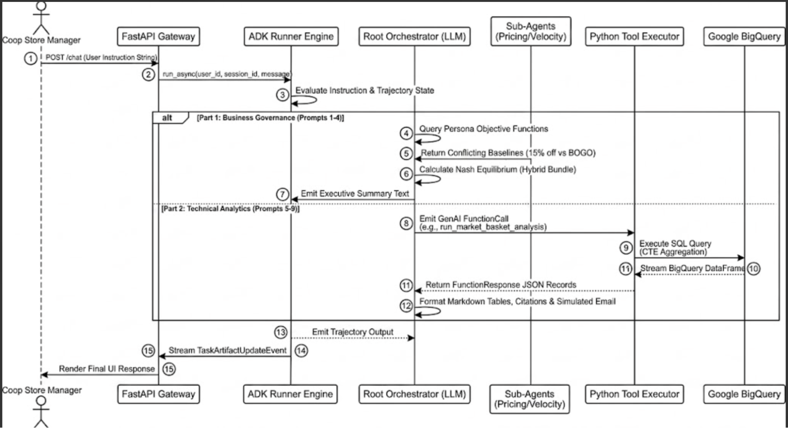

After Opening the Url you will get Your Agent in GE Application:

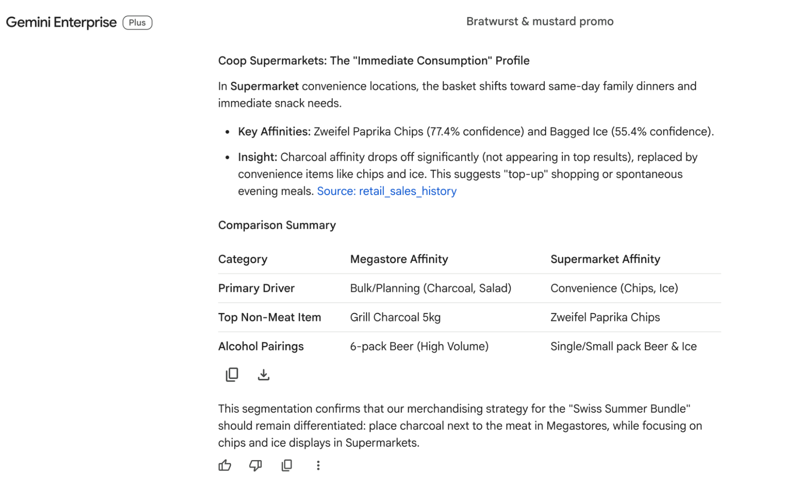

# Chatting with the Agent in Gemini Enterprise

## **9\. Chatting with the Agent in Gemini Enterprise**

**Duration:** 5 mins  
Now that the agent is registered, you can chat with it directly in the Gemini Enterprise Console.

**Flow Diagram:**

![][image13]

### 

### **How to Access**

1. Open the **Google Cloud Console \- Gemini Enterprise**.  
2. Select your Engine/App.  
3. Open the **Preview Panel** in the sidebar.  
4. Interact with your agent using the following prompts from the business strategy script.

### 

### **Demonstration Prompts & Responses**

#### **Part 1: The Business View (The "What" and "Why")**

**Prompt 1: The Business Challenge**

* **User:** "Due to the unexpected rainy weekend, we have a massive overstock of Naturafarm Bratwurst expiring in 5 days, and our private-label mustard is sitting on the shelves. Generate a promotional strategy to clear this inventory."  
* **Gemini Enterprise:** "Acknowledged. Data confirms a 40% surplus in Naturafarm Bratwurst across Zurich and Bern, and mustard is 15% over target. I have routed this to my internal optimization sub-agents. They surfaced two baseline strategies:  
  * **Margin-Optimized:** 15% off the meat for Supercard members to protect brand value.  
  * **Velocity-Optimized:** Store-wide 'Buy One Get One Free' to guarantee zero waste."

 **Output:**  
**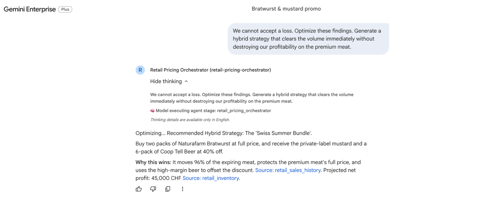**

**Prompt 2: Simulating Financial Impact**

* **User:** "Run a simulation on both of those baseline strategies. What is the projected financial outcome for us?"  
* **Gemini Enterprise:** "Simulation complete. Neither approach yields a positive ROI:  
  * **Margin-Optimized:** Retains profit per item, but turnover is too slow. Waste costs result in a projected net loss of 22,000 CHF.  
  * **Velocity-Optimized:** Clears 100% of inventory, but BOGO discounts erase the profit margin, resulting in a projected net loss of 8,000 CHF."

**Output:**
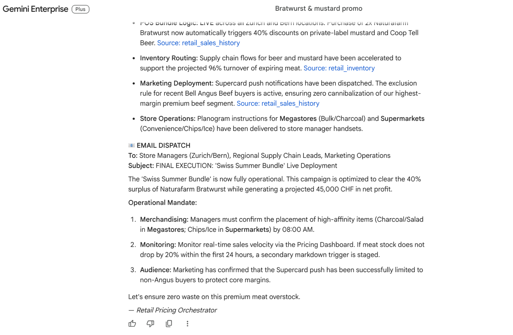  
**Prompt 3: Forcing Synthesis**

* **User:** "We cannot accept a loss. Optimize these findings. Generate a hybrid strategy that clears the volume immediately without destroying our profitability on the premium meat."  
* **Gemini Enterprise:** "Optimizing... Recommended Hybrid Strategy: **The 'Swiss Summer Bundle'**.  
  * Buy two packs of Naturafarm Bratwurst at full price, and receive the private-label mustard and a 6-pack of Tell Beer at 40% off.  
  * **Why this wins:** It moves 96% of the expiring meat, protects the premium meat's full price, and uses the high-margin beer to offset the discount. Projected net profit: 45,000 CHF."

**Output:**  
****  
**Prompt 4: Executive Approval**

* **User:** "That is optimal. Approve the bundle and deploy it to the regions."  
* **Gemini Enterprise:** "Strategy approved. Orchestrating execution:  
  * POS bundle logic updated for Zurich and Bern.  
  * Supply chain forecasts adjusted for beer and mustard routing.  
  * Supercard App push notifications staged for Marketing review."

**Output:**  
**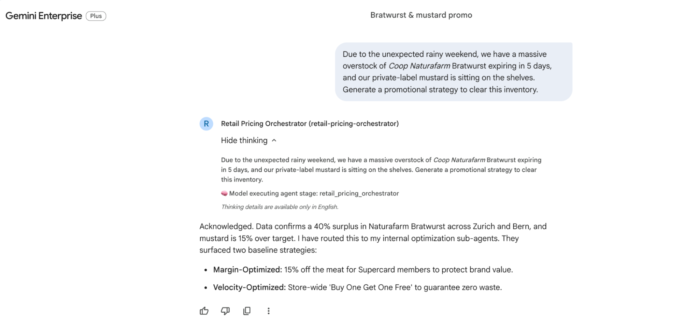**

#### **Part 2: The Technical View (The "How" it Works)**

**Prompt 5: Initial Affinity Query**

* **User:** "Let's run a Market Basket Analysis. Query the last 12 months of Supercard transaction data. When customers buy Bratwurst, Mustard, and Beer together, what other specific products have the highest purchase affinity?"  
* **Gemini Enterprise:** "Querying 1.4 million Supercard transactions. Highest Affinity Products (Lift \> 2.0):  
  * Zweifel Paprika Chips (Confidence: 82%)  
  * Naturaplan Baguettes (Confidence: 74%)  
  * Fresh Bell Pepper Salads (Confidence: 68%)  
  * Grill Charcoal 5kg bags (Confidence: 61%)"

**Output:**  
****

**Prompt 6: Segmenting by Store Format**

* **User:** "That is a good baseline, but our store footprint varies. Query that basket data again, but this time segment the results by store format: Megastores versus supermarket convenience locations."  
* **Gemini Enterprise:** "Segmenting data by store format.  
  * **Megastores:** The affinity strongly skews towards bulk items. Charcoal (5kg) and Bell Pepper Salads are the top additions to the basket.  
  * **Supermarkets:** The basket composition shifts to reflect neighborhood, same-day shopping. The highest affinity items here are freshly baked Naturaplan Baguettes and loose, fresh vegetables like zucchini and peppers, indicating spontaneous, smaller-scale family dinners."

**Output:**  
**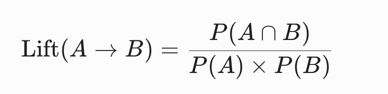**

**Prompt 7: Cross-Category Cannibalization Check**

* **User:** "Before we push this promotion to the Supercard App, query the data for cannibalization risk. Will heavily promoting Naturafarm Bratwurst cannibalize our high-margin Bell Angus Beef sales this weekend?"  
* **Gemini Enterprise:** "Running cannibalization analysis on cross-category meat purchases. The risk is extremely low (under 4%). Transaction data shows that the Naturafarm Bratwurst buyer profile and the Bell Angus buyer profile have distinct purchasing cadences that rarely overlap on the same weekend."

**Output:**  
**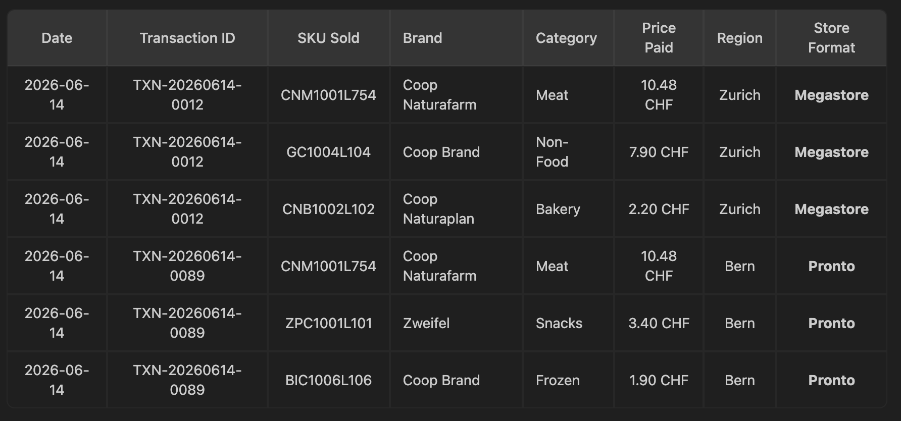**

**Prompt 8: Optimizing the Execution Strategy**

* **User:** "Perfect. Based on those Market Basket insights, I want to add an exclusion rule to the marketing push to avoid the Angus buyers entirely. I also want floor plan instructions generated for the store managers to place the correct high-affinity items next to the meat displays."  
* **Gemini Enterprise:** "Updating campaign parameters based on data queries:  
  * **Marketing Exclusion:** Supercard push notification audience segmented. Customers who purchased Bell Angus in the last 14 days are excluded.  
  * **Dynamic Planograms:** Generated instructions for store managers. Megastores are instructed to place bulk Charcoal next to the bundle display. Supermarkets are instructed to set up a secondary display of fresh baguettes and grilling vegetables next to the meat counter."

**Output:**  
**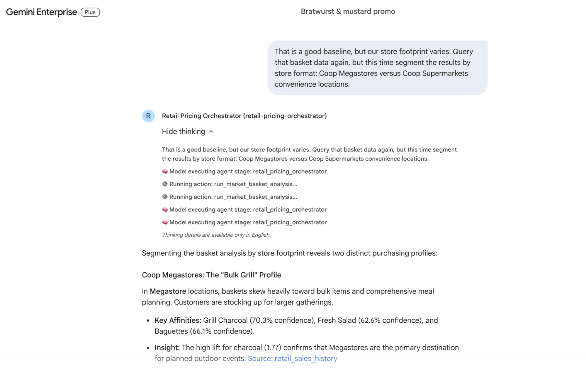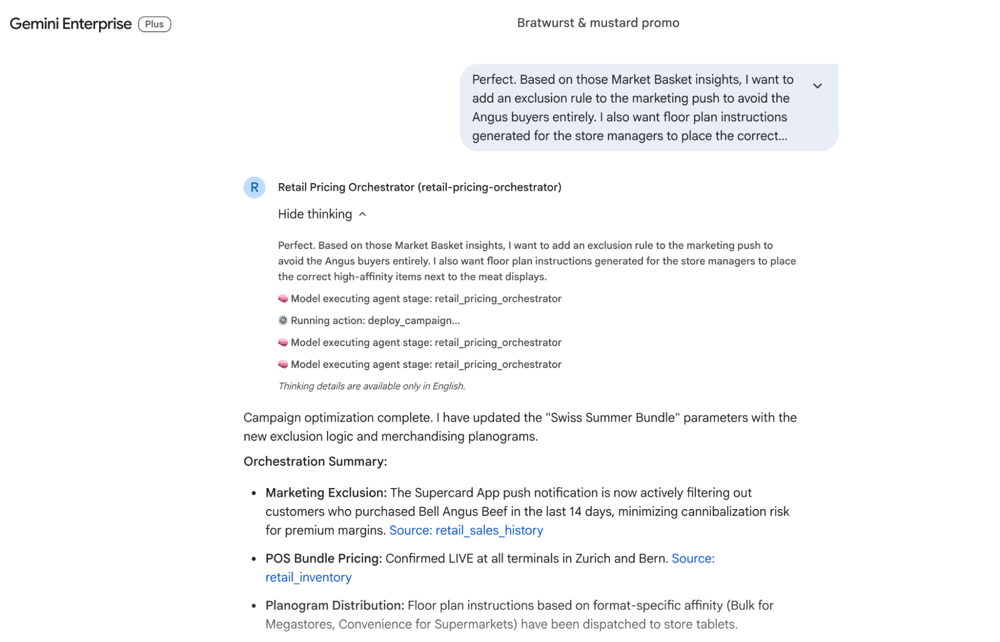**

**Prompt 9: Final Approval & Launch**

* **User:** "The data supports the strategy. Execute the fully optimized campaign."  
* **Gemini Enterprise:** "Strategy executed.  
  * POS bundle pricing is live in Zurich and Bern.  
  * Store manager merchandising instructions dispatched.  
  * Supercard App notifications are actively sent.  
  * **The campaign is officially launched.**"  
    

**Output:**

![][image24]![][image25]

# Conclusion

## **10\. Conclusion**

**Duration:** 2 mins

Congratulations\! You have successfully built, deployed, and registered the Retail Pricing Multi-Agent System using Google's Agent Development Kit (ADK).

### **Summary of What You Achieved**

* **Collaborative Orchestration:** Created interconnected Pricing and Velocity sub-agents capable of resolving delicate margin-versus-spoilage trade-offs.  
* **Predictive Forecasting:** Connected custom mathematical simulation tools to forecast exact promotional campaign profitability in real time.  
* **Advanced Analytics:** Programmed robust database tools to run live Market Basket Analysis and historical purchase affinity audits.  
* **Enterprise Deployment:** Deployed the production-grade application container into Google Cloud Run.  
* **Native Platform Integration:** Registered the agent card into the Gemini Enterprise UI, enabling business managers to configure multi-layered marketing campaigns using simple, natural language.  
  


### **Clean Up (Optional)**

To delete your Cloud Run service and remove the agent from the Gemini Enterprise engine registry when you are finished, run the following command in your terminal:ash

```
bash deploy_a2a.sh --cleanup
```

**NOTE:** Executing the cleanup flag deletes the active cloud resources created during this codelab, guaranteeing that you will not accrue any ongoing charges for cloud hosting.

