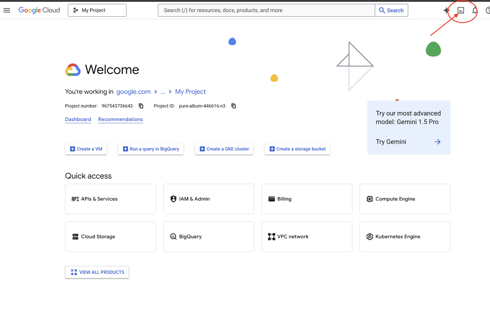
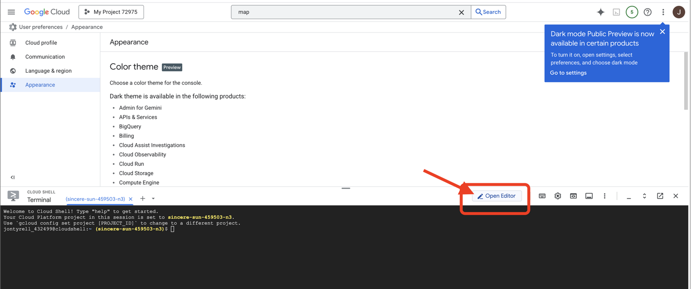
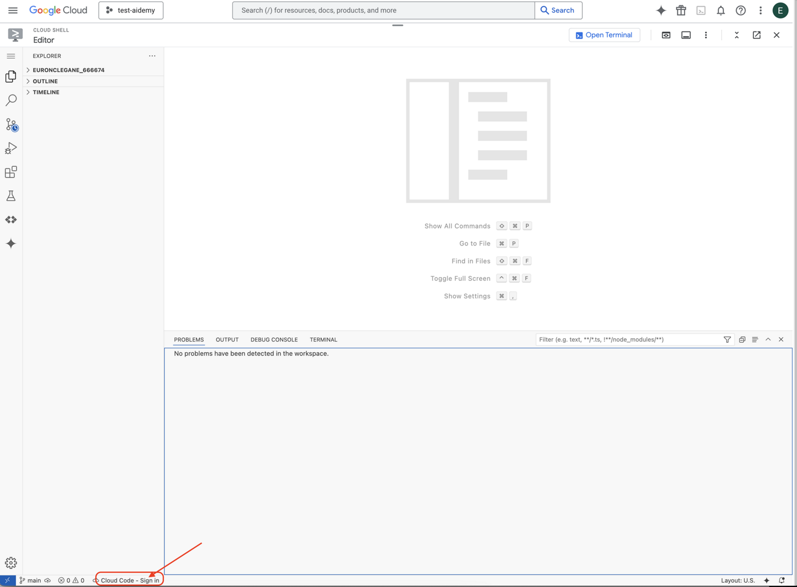
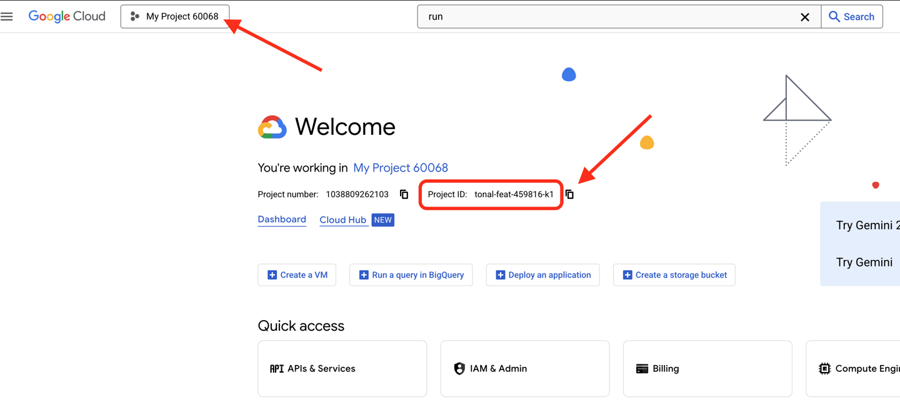
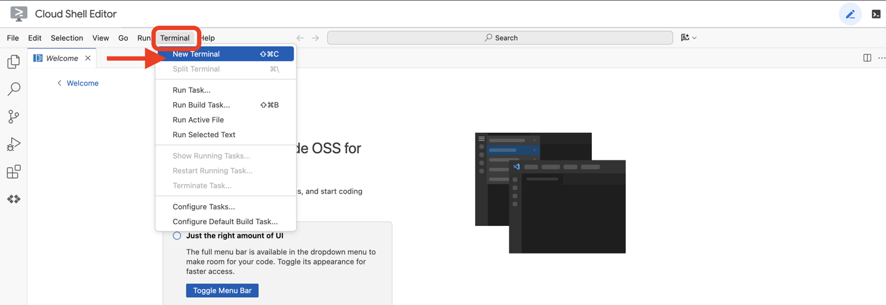
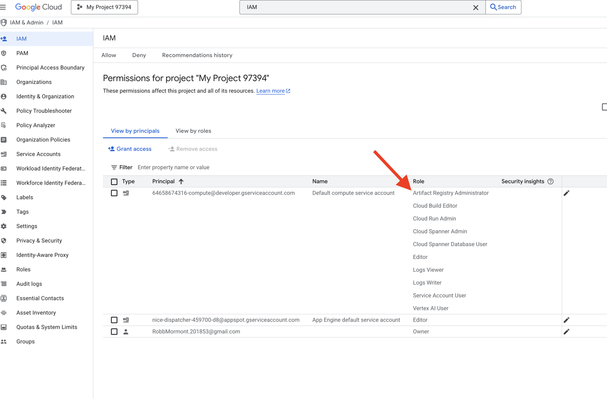
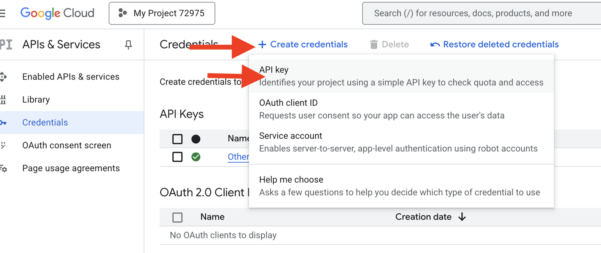
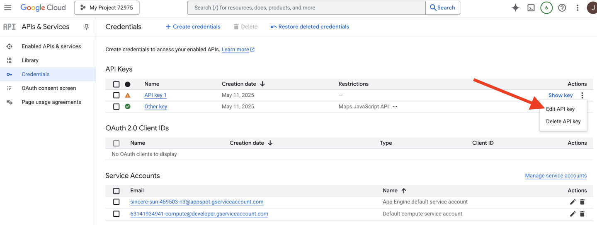
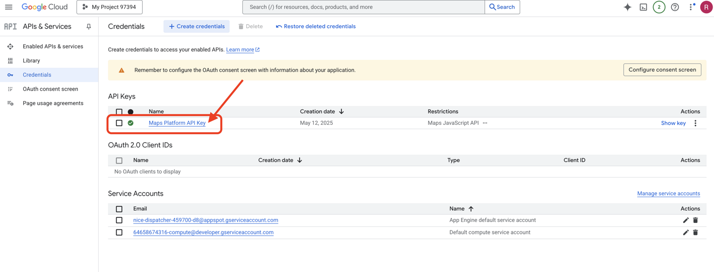
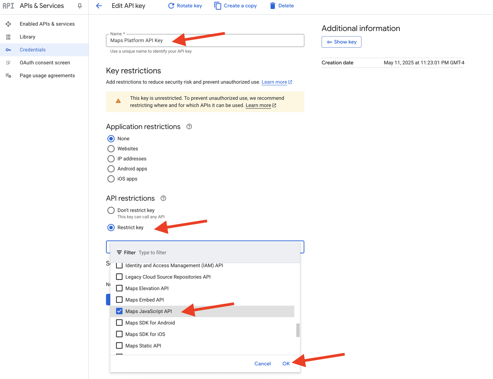

# Setup
- 👉 Click **Activate Cloud Shell** at the top of the Google Cloud console (It's the terminal shape icon at the top of the Cloud Shell pane).
    
- 👉 Click on the "**Open Editor**" button (it looks like an open folder with a pencil). This will open the Cloud Shell Code Editor in the window. You'll see a file explorer on the left side.
    
- 👉 Click on the **Cloud Code Sign-in** button in the bottom status bar as shown. Authorize the plugin as instructed. If you see *Cloud Code - no project* in the status bar, select that then in the drop down ‘Select a Google Cloud Project' and then select the specific Google Cloud Project from the list of projects that you created. 
    
- 👉 Find your Google Cloud Project ID:
  1. Open the Google Cloud Console: `https://console.cloud.google.com`
  2. Select the project you want to use for this workshop from the project dropdown at the top of the page.
  3. Your Project ID is displayed in the Project info card on the Dashboard.
    
- 👉 Open the terminal in the cloud IDE.
    ]
- 👉💻 In the terminal, verify that you're already authenticated and that the project is set to your project ID using the following command: `gcloud auth list`
- 👉💻 Clone the instavibe-bootstrap project from GitHub:

```bash
git clone -b adk-1.2.1-a2a-0.2.7 https://github.com/weimeilin79/instavibe-bootstrap.git
chmod +x ~/instavibe-bootstrap/init.sh
chmod +x ~/instavibe-bootstrap/set_env.sh 
```

## Understanding the Project Structure
Before we start building, let's take a moment to understand the layout of the instavibe-bootstrap project you just cloned. This will help you know where to find and edit files throughout the workshop.

```
instavibe-bootstrap/
├── agents/
│   ├── orchestrate/
│   ├── planner/
│   ├── platform_mcp_client/
│   └── social/
├── instavibe/
│   ├── static/
│   └── templates/
├── tools/
│   └── instavibe/
├── utils/
├── init.sh
└── set_env.sh
```

Here is a breakdown of the key directories:  
**agents/**: This is the heart of our AI system. Each subdirectory (planner/, social/, etc.) contains the source code for a specific intelligent agent.  


- `agent.py`: Inside each agent's folder, this is the main file where the agent's logic.
- `a2a_server.py`: This file wraps the ADK agent with an Agent-to-Agent (A2A) server.
- `Dockerfile`: Defines how to build the container image for deploying the agent to Cloud Run or Agent Engine.
- `instavibe/`: This directory contains the entire source code for the InstaVibe web application.
- `tools/`: This directory is for building external tools that our agents can use.
- `instavibe/` contains the Model Context Protocol (MCP) Server.

This modular structure separates the web application from the various AI components, making the entire system easier to manage, test, and deploy.

- 👉💻 Run the initialization script:

This script will prompt you to enter your Google Cloud Project ID.

- 👉 Enter Google Cloud Project ID you found from the last step when prompted by the init.sh script:

```bash
cd ~/instavibe-bootstrap
./init.sh
```
- 👉💻 Set the Project ID needed:
`gcloud config set project $(cat ~/project_id.txt) --quiet`

- 👉💻 Run the following command to enable the necessary Google Cloud APIs:
```bash
gcloud services enable  run.googleapis.com \
                        cloudfunctions.googleapis.com \
                        cloudbuild.googleapis.com \
                        artifactregistry.googleapis.com \
                        spanner.googleapis.com \
                        apikeys.googleapis.com \
                        iam.googleapis.com \
                        compute.googleapis.com \
                        aiplatform.googleapis.com \
                        cloudresourcemanager.googleapis.com \
                        maps-backend.googleapis.com
```

- 👉💻 Set all the environment variable needed:
```bash
export PROJECT_ID=$(gcloud config get project)
export PROJECT_NUMBER=$(gcloud projects describe ${PROJECT_ID} --format="value(projectNumber)")
export SERVICE_ACCOUNT_NAME=$(gcloud compute project-info describe --format="value(defaultServiceAccount)")
export SPANNER_INSTANCE_ID="instavibe-graph-instance"
export SPANNER_DATABASE_ID="graphdb"
export GOOGLE_CLOUD_PROJECT=$(gcloud config get project)
export GOOGLE_GENAI_USE_VERTEXAI=TRUE
export GOOGLE_CLOUD_LOCATION="us-central1"
```

## Setting up Permissions
```bash
gcloud projects add-iam-policy-binding $PROJECT_ID \
  --member="serviceAccount:$SERVICE_ACCOUNT_NAME" \
  --role="roles/spanner.admin"

# Spanner Database User
gcloud projects add-iam-policy-binding $PROJECT_ID \
  --member="serviceAccount:$SERVICE_ACCOUNT_NAME" \
  --role="roles/spanner.databaseUser"

# Artifact Registry Admin
gcloud projects add-iam-policy-binding $PROJECT_ID \
  --member="serviceAccount:$SERVICE_ACCOUNT_NAME" \
  --role="roles/artifactregistry.admin"

# Cloud Build Editor
gcloud projects add-iam-policy-binding $PROJECT_ID \
  --member="serviceAccount:$SERVICE_ACCOUNT_NAME" \
  --role="roles/cloudbuild.builds.editor"

# Cloud Run Admin
gcloud projects add-iam-policy-binding $PROJECT_ID \
  --member="serviceAccount:$SERVICE_ACCOUNT_NAME" \
  --role="roles/run.admin"

# IAM Service Account User
gcloud projects add-iam-policy-binding $PROJECT_ID \
  --member="serviceAccount:$SERVICE_ACCOUNT_NAME" \
  --role="roles/iam.serviceAccountUser"

# Vertex AI User
gcloud projects add-iam-policy-binding $PROJECT_ID \
  --member="serviceAccount:$SERVICE_ACCOUNT_NAME" \
  --role="roles/aiplatform.user"

# Logging Writer (to allow writing logs)
gcloud projects add-iam-policy-binding $PROJECT_ID \
  --member="serviceAccount:$SERVICE_ACCOUNT_NAME" \
  --role="roles/logging.logWriter"

gcloud projects add-iam-policy-binding $PROJECT_ID \
  --member="serviceAccount:$SERVICE_ACCOUNT_NAME" \
  --role="roles/logging.viewer"
```

- 👉 Validate result in your IAM console.
)
- 👉💻 Run the following commands in the terminal to create a Artifact Registry repository. All Docker images for our agents, the MCP server, and the InstaVibe application are stored here before deployment to Cloud Run or Agent Engine.

```bash
export REPO_NAME="introveally-repo"
gcloud artifacts repositories create $REPO_NAME \
  --repository-format=docker \
  --location=us-central1 \
  --description="Docker repository for InstaVibe workshop"
```

Setup Map platform for API Keys
To use Google Maps services in your InstaVibe application, you need to create an API key and restrict it appropriately.
- 👉 In a new tab, go to APIs & Services > Credentials. On the "Credentials" page, click the + CREATE CREDENTIALS button at the top. Select API key from the dropdown menu.

- 👉 A dialog box will appear showing your newly created API key. You'll need it later for your application configuration.
- 👉 Click CLOSE on the "API key created" dialog.
- 👉 You will see your new API key listed (e.g., "API key 1"). Click on the three dots on the right select Edit API key to open the "Restrict and rename API key" page.

- 👉 In the Name field at the top, change the default name to: Maps Platform API Key (🚨🚨IMPORTANT🚨🚨 Please use this name!)
`Maps Platform API Key`
- 👉 Under the "Application restrictions" section ensure None is selected.
- 👉 Under the "API restrictions" section, select the Restrict key radio button.
- 👉 Click the Select APIs dropdown menu. In the search box that appears, type `Maps JavaScript API` and select it from the list.

- 👉 Click OK.
- 👉 Click the SAVE button at the bottom of the page.


You have now successfully created an API key named "Maps Platform API Key," restricted it to only allow usage of the "Maps JavaScript API," and ensured the API is enabled for your project.
