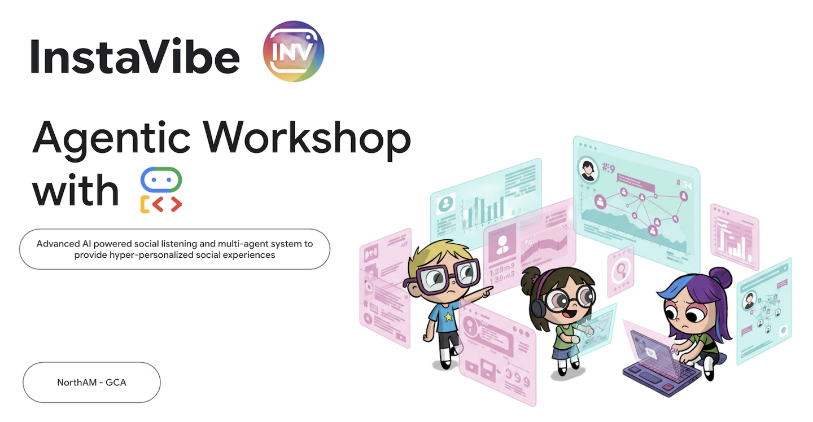

# Google's Agent Stack in Action: ADK, A2A, MCP on Google Cloud
*Originally authored by: Christina Lin (linchr@)*  
*Adapted for the Agentspace Hackathon by: Sanchit Alekh (sanchitalekh@)*  

## 1. What You Will Learn
Welcome! We're about to embark on a pretty cool journey today. Let's start by thinking about a popular social event platform InstaVibe. While it's successful, we know that for some users, the actual planning of group activities can feel like a chore. Imagine trying to figure out what all your friends are interested in, then sifting through endless options for events or venues, and finally coordinating everything. It's a lot! This is precisely where we can introduce AI, and more specifically, intelligent agents, to make a real difference.

The idea is to build a system where these agents can handle the heavy lifting, like cleverly ‘listening' to understand user and friend preferences, and then proactively suggesting fantastic, tailored activities. Our aim is to transform social planning on InstaVibe into something seamless and delightful. To get started on building these smart assistants, we need to lay a strong groundwork with the right tools.

Here are the concepts you'll learn:

- Foundations with Google's ADK: Master the fundamentals of building your first intelligent agent using Google's Agent Development Kit (ADK). Understand the essential components, the agent lifecycle, and how to leverage the framework's built-in tools effectively.
- Foundations with Google's **ADK**: Master the fundamentals of building your first intelligent agent using Google's [Agent Development Kit (ADK)](https://google.github.io/adk-docs/). Understand the essential components, the agent lifecycle, and how to leverage the framework's built-in tools effectively.

- Extending Agent Capabilities with **Model Context Protocol (MCP)**: Learn to equip your agents with custom tools and context, enabling them to perform specialized tasks and access specific information. Introduce the [Model Context Protocol (MCP)](https://modelcontextprotocol.io/docs/getting-started/intro) concept. You'll learn how to set up an MCP server to provide this context.

- Designing Agent Interactions & Orchestration: Move beyond single agents to understand agent orchestration. Design interaction patterns ranging from simple sequential workflows to complex scenarios involving loops, conditional logic, and parallel processing. Introduce the concept of sub-agents within the **ADK** framework to manage modular tasks.

- Building Collaborative Multi-Agent Systems: Discover how to architect systems where multiple agents collaborate to achieve complex goals. Learn and implement the **Agent-to-Agent (A2A)** communication protocol, establishing a standardized way for distributed agents (potentially running on different machines or services) to interact reliably.

- Productionizing Agents on Google Cloud: Transition your agent applications from development environments to the cloud. Learn best practices for architecting and deploying scalable, robust multi-agent systems on **Google Cloud Platform (GCP)**. Gain insights into leveraging **GCP** services like Cloud Run and explore the capabilities of the latest Google Agent Engine for hosting and managing your agents.