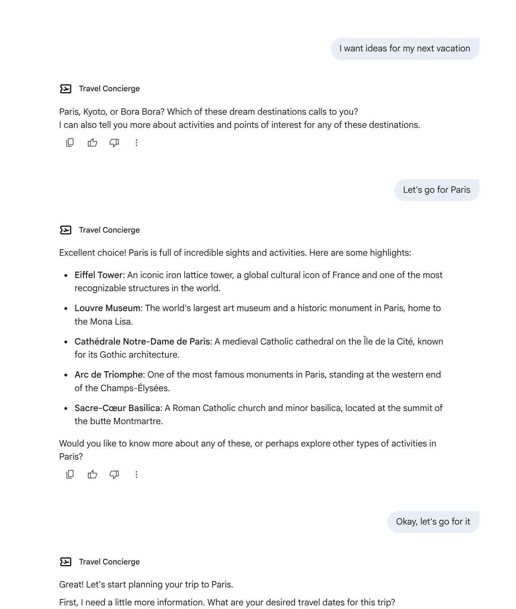

# 🚀 Travel Concierge Hackathon Guide 🚀

Welcome, participants! This guide will walk you through setting up, running, and modifying your very own AI-powered Travel Concierge. Our goal is to get you hands-on with agent development as quickly as possible.

Let's get started!

---

## Lab 4.1: Quick Start - Running Your Agent

This first lab is all about getting the agent running on your machine.

1.  **Run the Automated Setup Script:**
    This script will install all the necessary dependencies for you.

    ```bash
    bash setup.sh
    ```
    After the script finishes, it will remind you to edit the newly created `.env` file.

2.  **Configure Your Environment:**
    Open the `.env` file in your editor and fill in the required values:
    *   `GOOGLE_CLOUD_PROJECT`: Your Google Cloud Project ID.
    *   `GOOGLE_PLACES_API_KEY`: Your API Key for the Google Maps Platform Places API. [Click here for instructions on how to get one](https://developers.google.com/maps/documentation/places/web-service/get-api-key).

3.  **Authenticate with Google Cloud:**
    This command allows the application to use your Google Cloud credentials. (not required if you are running in Cloud Shell Editor.)
    ```bash
    gcloud auth application-default login
    ```

4.  **Run the Agent!**
    You're all set. You can just activate the Python environment created by ***uv*** and run the agent.
    ```bash
    source .venv/bin/activate
    uv run adk web
    ```
    Now, open your browser to [http://127.0.0.1:8000](http://127.0.0.1:8000). Select `travel_concierge` from the dropdown menu, and you can start chatting with your agent!
    **💡 Tip:** If you are running the Cloud Shell Editor, you can simply open the agent in the **Web Preview** tab. It defaults to port 8000, so you don't have to do anything.

    


    **✅ Goal:** Successfully interact with the agent.  
    **💡 Things to Try:** Ask the agent: *"Need some destination ideas for the Americas."*

---

## Lab 4.2: Understanding the Code

Now that the agent is running, let's take a peek under the hood to see how it works.

*   **Goal:** Learn to navigate the project structure and find key components.
*   **Task:** The agent that handles initial inspiration is called the `inspiration_agent`. Your task is to find its core instructions, also known as its "prompt".
*   **Hint:** Look inside the `travel_concierge/sub_agents/inspiration/` directory. The main files which define the behaviour of the agent are `prompt.py` and `agent.py`. 
              Read through them to see how the agent is instructed to behave. Try to interact with the agent with your travel questions, and as you build up your conversation,
              pay attention to:  
              - **Sessions:** A Session is like a complete notebook for a single, continuous conversation.  
              - **Events:** Events are all the individual messages and notes written sequentially in that notebook, forming a complete transcript.  
              - **State:** State is a sticky note on the notebook's cover where you jot down the current important details so you don't have to re-read the entire notebook every time.  

---

## Lab 4.3: Integrating a New Tool: Search

As you interact with the agent, you'll notice a significant limitation: it's making things up! 😲 The LLM generates details for hotels and flights without consulting real-world data.

This means if a user asks for more information about a hotel from the `Hotel Search Agent`, the response won't be grounded in reality. That's not very helpful!

Let's fix this by giving our agent a superpower: **the power of Google Search!** 🦸‍♀️

*   **Goal:** Enhance an agent's capabilities by giving it access to real-time information from the internet.
*   **Task:** We'll integrate the `GoogleSearchGrounding` tool with the `planning_agent`.
    1.  Open `travel_concierge/sub_agents/planning/agent.py`.
    2.  Import the `GoogleSearchGrounding` tool by adding this line at the top of the file: `from travel_concierge.tools.search import google_search_grounding`.
    3.  Add `google_search_grounding` to the list of tools passed to the `PlanningAgent`.
    4.  Restart the agent (`Ctrl+C` and `uv run adk web`).
    5.  After you ask for destination ideas, ask the planning agent a question that requires web access, for example: *"What restaurants does the Oberoi Udaivilas Hotel in Udaipur have?"*

---

## Lab 4.4: Integrating an MCP Tool

In this lab, we'll add a new MCP tool for searching Airbnb listings. MCP servers are useful because they allow agents to interact with external APIs and services in a standardized way.

*   **Goal:** Integrate a new tool to search for real B&B listings.
*   **Task:** We will use the OpenBNB MCP server. All the code is already in the 
              `lab4/agent-enhancemements-knowledge` branch. 
    1. First, checkout the branch and install the new dependencies:
        ```bash
              git checkout lab4/agent-enhancemements-knowledge
              uv sync
        ```

    2. Now we will integrate this new tool. The tool is integrated in the following way:
      ```python
      airbnb_toolset = McpToolset(
          connection_params=StdioServerParameters(
              command='npx',
              args=["-y",
                    "@openbnb/mcp-server-airbnb",
                    os.path.abspath(TARGET_FOLDER_PATH),
                    "--ignore-robots-txt",
                  ],
          )
      )
      ```

---

### Sample Agent interaction

Two example sessions are provided to illustrate how the Travel Concierge operates.

- Trip planning from inspiration to finalized bookings for a trip to Peru ([`tests/pre_booking_sample.md`](tests/pre_booking_sample.md)).
- In-trip experience for a short get away to Seattle, simulating the passage of time using a tool ([`tests/post_booking_sample.md`](tests/post_booking_sample.md)).

### Worth Trying

Instead of interacting with the concierge one turn at time. Try giving it the entire instruction, including decision making criteria, and watch it work, e.g.

*"Find flights to London from JFK on April 20th for 4 days. Pick any flights and any seats; also Any hotels and room type. Make sure you pick seats for both flights. Go ahead and act on my behalf without my input, until you have selected everything, confirm with me before generating an itinerary."*

Without specifically optimizing for such usage, this cohort of agents seem to be able to operate by themselves on your behalf with very little input.


## 🚀 Deploying the Agent 🚀

### Step 1: Deploying to Agent Engine

> **⚡️ Pro Tip: ⚡️**
>
> The [Agent Starter Pack](https://goo.gle/agent-starter-pack) can create a production-ready version of this agent for you! It handles the full end-to-end deployment and adds other cool features.

Ready to deploy? Let's go!

```bash
# Make sure that the virtual environment created by uv is still active
source .venv/bin/activate # On Windows: .venv\Scripts\activate

# Install the starter pack and create your project
uv pip install --upgrade agent-starter-pack

# Make sure you are in the right folder (lab4)
cd lab4

# The `enhance` function of the agent-starter-pack adds deployment resources to your repository
uvx agent-starter-pack enhance travel_concierge

# Now we are ready to deploy
make deploy
```

You'll be asked a few questions. Here's a cheat sheet:

*   **Continue with enhancement?** `Y` 👍
*   **Select base template:** `adk_base` 뼈
*   **Select agent directory:** `travel_concierge` ✈️
*   **Deployment target choice:** `1` 🎯
*   **CI/CD runner choice:** `1` 🏃‍♀️
*   **Desired GCP region:** `us-central1` (or your preferred region) 🌎

Now, confirm your credentials and watch the magic happen! ✨

At the end, the process will have deployed our app to Agent Engine, which is the starting point for integrating it with Gemini Enterprise. 
The output will also give us an ID of a *Reasoning Engine* Resource. Keep note of it as we will need it later.

### 🚀 Step 2: Deploy to Gemini Enterprise 🚀

Before we launch our agent into the world, let's do a little housekeeping. 🧹

#### ✅ Pre-flight Checklist:

1.  **Enable the Discovery Engine API:**
    *   Head over to the [Discovery Engine API page](https://console.cloud.google.com/apis/api/discoveryengine.googleapis.com/metrics?_gl=1*1hdazko*_ga*MTU4Mzk0OTM2Ni4xNzYyMzQ5MDE0*_ga_4LYFWVHBEB*czE3NjIzNTg0MzAkbzIkZzAkdDE3NjIzNTg0MzAkajYwJGwwJGgw) in the Google Cloud console.
    *   Make sure you've enabled it for your project. ✅

2.  **Grant Permissions:**
    *   Enable the **Vertex AI User** and **Vertex AI Viewer** roles for both your Discovery Engine service account and your GCP account. This is super important so Gemini Enterprise can talk to your agent! 🗣️
    *   > **💡 Tip:** To find your Discovery Engine service account, go to the IAM page and check the "Include Google-provided role grants" box.
    *   Go to the IAM page and search for "Discovery Engine". Add the necessary permissions to your service account. 🔐

#### 🚀 Launch Sequence:

Now, let's get our deployment script ready!

```bash
# Navigate to the right directory
cd agent_registration_tool

# Open register_agent.sh or register_agent.http
# Fill in your Gemini Enterprise App ID and Reasoning Engine App ID.

# Make the script executable
chmod +x register_agent.sh

# Run the script!
./register_agent.sh
```

Once the script finishes, head over to Gemini Enterprise. You'll see your shiny new agent in the **Agents** tab! 🎉


Click on **Travel Concierge** and start chatting with your creation! 🤖💬




### Refining Agents

The following are just the starting ideas:

- A more sophisticated itinerary and activity planning agent; For example, currently the agent does not handle flights with lay-over.
- Better accounting - accuracy in calculating costs on flights, hotels + others.
- A booking agent that is less mundane and more efficient
- For the pre-trip and in-trip agents, there are opportunities to dynamically adjusts the itinerary and resolves trip exceptions

## Common Issues & Troubleshooting

*   **Issue:** `uv: command not found`
    *   **Solution:** `uv` is not installed. Follow the official instructions here: [https://docs.astral.sh/uv/install.sh](https://docs.astral.sh/uv/install.sh).

*   **Issue:** Agent returns a "Malformed function call" or a Pydantic error.
    *   **Solution:** This can happen if the AI model's response isn't perfectly structured. The agent can often fix this itself. Just reply with **"try again"**.
    *   In case you want to change the structure of your answers, you can also do that by changing the definition of the Pydantic classes.

*   **Issue:** `gcloud` authentication errors.
    *   **Solution:** Make sure you have the Google Cloud SDK installed and have successfully run `gcloud auth application-default login`. Also, ensure the Vertex AI API is enabled for your project in the Google Cloud Console

## Disclaimer

This agent sample is provided for illustrative purposes only and is not intended for production use. It serves as a basic example of an agent and a foundational starting point for individuals or teams to develop their own agents.

This sample has not been rigorously tested, may contain bugs or limitations, and does not include features or optimizations typically required for a production environment (e.g., robust error handling, security measures, scalability, performance considerations, comprehensive logging, or advanced configuration options).

Users are solely responsible for any further development, testing, security hardening, and deployment of agents based on this sample. We recommend thorough review, testing, and the implementation of appropriate safeguards before using any derived agent in a live or critical system.
